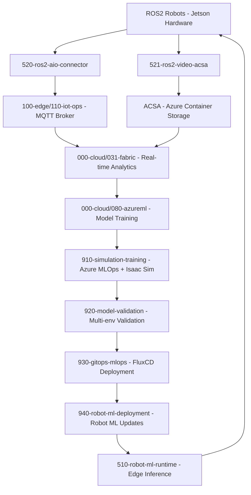

<!-- markdownlint-disable-file -->
# Task Research Documents: MLOps Architecture for ROS2-Robot Edge AI System

A comprehensive analysis of implementing a full-loop MLOps system for ROS2-enabled robots with Jetson hardware, Arc-connected K3s edge clusters, Azure Fabric data integration, and multi-stage model training/validation using IL/RL approaches with containerized deployment via GitOps.

## Table of Contents
- [Scope and Success Criteria](#scope-and-success-criteria)
- [Outline](#outline)
- [Sub-Research Documents](#sub-research-documents)
- [Research Executed](#research-executed)
- [Key Discoveries](#key-discoveries)
- [Technical Scenarios](#technical-scenarios)

## Scope and Success Criteria
- **Scope**: Complete MLOps architecture from robot data collection through Fabric analytics to model training/deployment with validation loops
- **Assumptions**:
  - ROS2 robots with Jetson hardware running containerized workloads
  - K3s Arc-enabled edge clusters for data aggregation and model hosting
  - Azure Fabric for data storage and analytics
  - AzureML and NVIDIA OSMO for model training capabilities
  - GitOps-based deployment patterns for model distribution
- **Success Criteria**:
  - Complete architecture diagram specification for MLOps system
  - Terraform component analysis for supporting infrastructure
  - Implementation roadmap with identified gaps and solutions
  - Containerization and deployment strategy for models

## Outline
1. **Architecture Components Analysis**
   - Robot-to-Edge data flow (ROS2 → K3s Arc cluster)
   - Edge-to-Cloud data integration (ACSA → Fabric)
   - Model training infrastructure (AzureML, NVIDIA OSMO)
   - Validation environments (AKS, simulation, edge testing)
   - GitOps deployment patterns

2. **Terraform Infrastructure Assessment**
   - Existing edge-ai components mapping to architecture requirements
   - Infrastructure gaps and extension needs
   - Component integration patterns

3. **Data Flow and Model Lifecycle**
   - Video/telemetry capture and processing
   - IL/RL training workflows with validation loops
   - Containerized model deployment strategies
   - Production validation and rollback mechanisms

## Sub-Research Documents

This research effort has been organized into specialized sub-research documents for detailed implementation guidance:

### **🚀 Application Components**
- **[ROS2 Application Components Research](./20250811-ros2-application-components-research.md)** - Comprehensive analysis of ROS2-to-Azure IoT Operations connectivity patterns, video streaming applications, and containerized deployment strategies
- **[Robot ML Runtime Research](./20250811-robot-ml-runtime-research.md)** - Detailed ML model runtime implementation for robot edge AI applications with ROS2 integration

### **🔧 Infrastructure Components**
- **[Container, Helm, Infrastructure & Security Research](./20250811-container-helm-infrastructure-security-research.md)** - Deep dive into Jetson-optimized containers, Helm chart patterns, CycloneDDS configuration, and production security hardening
- **[Simulation, Training & Model Validation Research](./20250811-simulation-training-model-validation-research.md)** - NVIDIA OSMO integration patterns, multi-environment validation pipelines, and Isaac Sim cloud deployment

### **🔄 Deployment & GitOps**
- **[GitOps MLOps Deployment Research](./20250811-gitops-mlops-deployment-research.md)** - FluxCD/ArgoCD deployment patterns for MLOps workloads with robot-specific GitOps integration

Each sub-research document contains complete implementation examples, configuration templates, and integration patterns specific to its domain area.

## 🚀 Implementation Requirements Summary

Based on comprehensive research analysis across all sub-research documents, the following components need to be implemented:

### **📦 New Application Components (src/500-application/)**

| Component | Purpose | Implementation Status | Reference Document |
|-----------|---------|----------------------|-------------------|
| **520-ros2-aio-connector** | ROS2 to Azure IoT Operations MQTT Bridge | 📋 **Ready for Implementation** | [ROS2 Components Research](./20250811-ros2-application-components-research.md) |
| **521-ros2-video-acsa** | ROS2 Video Streaming to Azure Container Storage | 📋 **Ready for Implementation** | [ROS2 Components Research](./20250811-ros2-application-components-research.md) |
| **510-robot-ml-runtime** | Containerized ML Model Runtime for Robot Edge AI | 📋 **Ready for Implementation** | [Robot ML Runtime Research](./20250811-robot-ml-runtime-research.md) |

### **🔧 New Utility Components (src/900-tools-utilities/)**

| Component | Purpose | Implementation Status | Reference Document |
|-----------|---------|----------------------|-------------------|
| **910-simulation-training** | NVIDIA OSMO + MLflow + Isaac Sim Integration | 📋 **Ready for Implementation** | [Simulation Training Research](./20250811-simulation-training-model-validation-research.md) |
| **920-model-validation** | Multi-Environment Validation Pipeline | 📋 **Ready for Implementation** | [Model Validation Research](./20250811-simulation-training-model-validation-research.md) |
| **930-gitops-mlops** | General GitOps Deployment Patterns for MLOps | 📋 **Ready for Implementation** | [GitOps MLOps Research](./20250811-gitops-mlops-deployment-research.md) |
| **940-robot-ml-deployment** | Robot-Specific ML Deployment with GitOps | 📋 **Ready for Implementation** | [GitOps MLOps Research](./20250811-gitops-mlops-deployment-research.md) |

### **📈 Component Enhancement Requirements**

| Existing Component | Enhancement Required | Reference Document |
|-------------------|---------------------|-------------------|
| **000-cloud/031-fabric** | IL/RL data processing capabilities | [Main Research](./20250811-mlops-ros2-robot-edge-architecture-research.md) |
| **000-cloud/080-azureml** | No enhancement needed - Pure AzureML services | [Main Research](./20250811-mlops-ros2-robot-edge-architecture-research.md) |
| **100-edge/110-iot-ops** | No enhancement needed - Pure IoT Operations | [Main Research](./20250811-mlops-ros2-robot-edge-architecture-research.md) |
| **000-cloud/060-acr** | FluxCD GitOps deployment patterns | [GitOps MLOps Research](./20250811-gitops-mlops-deployment-research.md) |

### **📋 Implementation Priority**

#### **Phase 1: Core Application Components** 🟢
1. **520-ros2-aio-connector** (High Priority) - Enables ROS2 to cloud data flow
2. **521-ros2-video-acsa** (High Priority) - Enables video streaming to cloud analytics
3. **510-robot-ml-runtime** (Medium Priority) - Enables edge ML inference capabilities

#### **Phase 2: Utility and GitOps Infrastructure** 🟡
4. **930-gitops-mlops** (Medium Priority) - Enables automated deployment patterns
5. **940-robot-ml-deployment** (Medium Priority) - Enables robot-specific deployments
6. **920-model-validation** (Low Priority) - Enables validation automation
7. **910-simulation-training** (Low Priority) - Enables advanced training workflows

#### **Phase 3: Advanced Integration and Optimization** 🔵
8. Container base image optimization and security hardening
9. CycloneDDS performance tuning and advanced configurations
10. Multi-environment validation pipeline automation
11. Advanced simulation training integration with OSMO workflows

## **🚀 Implementation Requirements List**

Based on comprehensive research analysis, the following components need to be implemented to complete the MLOps ROS2 Robot Edge Architecture:

### **📦 New Application Components (src/500-application/)**

#### **🔗 520-ros2-aio-connector** - ROS2 to Azure IoT Operations MQTT Bridge - STAGED [20250811-ros2-application-components-research.md](./20250811-ros2-application-components-research.md)
- **Primary Implementation**: C# application using Azure IoT Operations .NET SDK (L1185-1670)
- **Key Features**: Multi-topic ROS2 subscription, MQTT bridge with retry logic, CycloneDDS optimization, host network access
- **Artifacts**: Dockerfile, Helm charts, CI deployment configs, C# project files
- **Dependencies**: ROS2 Jazzy, Azure IoT Operations SDK, CycloneDDS middleware (L600-900)
- **Security**: Non-root containers, read-only filesystems, RBAC permissions
- **Reference**: Complete C# implementation and configuration examples (L1185-1670)

#### **📹 521-ros2-video-acsa** - ROS2 Video Streaming to Azure Container Storage - STAGED [20250811-ros2-application-components-research.md](./20250811-ros2-application-components-research.md)
- **Primary Implementation**: C# application with OpenCV processing and Azure Storage SDK (L2000-2800)
- **Alternative**: Python implementation with async processing capabilities (L2150-2400)
- **Key Features**: Video segmentation, compression, ACSA cloud ingest, persistent volume integration
- **Artifacts**: Multi-language Dockerfiles, Helm charts with PVC templates, ACSA configuration
- **Dependencies**: ROS2 Jazzy base images, OpenCV, Azure Storage SDK, ACSA volume drivers
- **Storage**: Requires ACSA persistent volume claims for cloud ingest (L2700-2800)
- **Reference**: Complete application structure and Helm chart templates (L2000-2800)

#### **🤖 New Application: Robot ML Model Runtime**

Containerized ML model inference runtime for robot edge AI applications with ROS2 integration.

**Location:** `/src/500-application/510-robot-ml-runtime/`

**Complete implementation details available in**: [20250811-robot-ml-runtime-research.md](./20250811-robot-ml-runtime-research.md)

### **🔧 New Utility Components (src/900-tools-utilities/)**

#### **🎮 910-simulation-training** - Azure MLOps + MLflow + Isaac Sim Integration - STAGED [20250811-simulation-training-model-validation-research.md](./20250811-simulation-training-model-validation-research.md)
- **Implementation**: Terraform modules for cloud-based training infrastructure (L950-1000)
- **Key Features**: Azure Machine Learning pipeline orchestration, MLflow experiment tracking, Isaac Sim environment integration
- **Integration**: Extends existing AzureML component (src/000-cloud/080-azureml/) with distributed training capabilities
- **Dependencies**: AzureML workspace, Azure compute instances, MLflow tracking server
- **Alternative**: Azure Databricks MLOps with automated model retraining and scheduled workflow triggers
- **Reference**: Azure MLOps workflow configuration and skrl RL integration patterns (L950-1000)

#### **✅ 920-model-validation** - Multi-Environment Validation Pipeline - STAGED [20250811-simulation-training-model-validation-research.md](./20250811-simulation-training-model-validation-research.md)
- **Implementation**: Terraform modules for validation orchestration (L4950-5000)
- **Key Features**: Simulation→AKS→Edge→Production validation workflow, human approval gates, rollback mechanisms
- **Environments**: Isaac Sim, AKS test clusters, Arc edge clusters, production validation
- **Integration**: Coordinates with existing validation infrastructure
- **Reference**: Multi-stage validation pipeline configuration (L4950-5000)

#### **🔄 930-gitops-mlops** - General GitOps Deployment Patterns for MLOps - STAGED [20250811-gitops-mlops-deployment-research.md](./20250811-gitops-mlops-deployment-research.md)
- **Implementation**: Terraform modules for FluxCD/ArgoCD GitOps deployment (L5000-5050)
- **Key Features**: FluxCD optimization for Azure Arc, ArgoCD alternative support, blue-green/canary deployments
- **Primary Strategy**: FluxCD for Azure Arc native integration
- **Dependencies**: Azure Arc enabled clusters, GitOps controllers, Helm repositories
- **Reference**: GitOps deployment pattern configuration (L5000-5050)

#### **🚀 940-robot-ml-deployment** - Robot-Specific ML Deployment with GitOps - STAGED [20250811-gitops-mlops-deployment-research.md](./20250811-gitops-mlops-deployment-research.md)
- **Implementation**: Terraform modules for robot fleet ML deployment automation (L5050-5100)
- **Key Features**: Robot-specific GitOps patterns, ROS2 integration, model update automation
- **Specialization**: Extends general GitOps patterns with ROS2 domain awareness
- **Dependencies**: Robot fleet management, model versioning, GitOps infrastructure
- **Reference**: Robot-specific deployment configuration (L5050-5100)

### **🐳 Container Base Image Strategy** - STAGED [20250811-container-helm-infrastructure-security-research.md](./20250811-container-helm-infrastructure-security-research.md)

- **Jetson Edge Images**: dustynv/ros:jazzy-* with CUDA 12.8, TensorRT, L4T R36.4.0
- **Isaac ROS Enhanced**: dustynv/isaac-ros:* with VPI acceleration, NITROS framework
- **Multi-Architecture**: ARM64 (Jetson edge) and AMD64 (cloud/AKS) support
- **Security Hardening**: Non-root users, read-only filesystems, capability dropping

### **📊 Helm Chart Templates and Deployment** - STAGED [20250811-container-helm-infrastructure-security-research.md](./20250811-container-helm-infrastructure-security-research.md)

- **520-ros2-aio-connector**: CycloneDDS configuration, environment variables, security contexts
- **521-ros2-video-acsa**: ACSA PVC integration, storage classes, multi-language support
- **510-robot-ml-runtime**: GPU resource management, model storage, MLflow integration
- **FluxCD Integration**: GitRepository and HelmRelease configurations

### **⚙️ Infrastructure Configuration Requirements** - STAGED [20250811-container-helm-infrastructure-security-research.md](./20250811-container-helm-infrastructure-security-research.md)

- **CycloneDDS Middleware Configuration**: XML configuration, container integration, performance tuning
- **K3s Pod to ROS2 Network Communication**: Host network access, MQTT bridge patterns, static discovery

### **🔐 Security and Production Hardening** - STAGED [20250811-container-helm-infrastructure-security-research.md](./20250811-container-helm-infrastructure-security-research.md)

- **Container Security Implementation**: Security contexts, RBAC configuration, network policies
- **DDS Security**: Authentication, authorization, encryption for ROS2 communication

### **📈 Integration Points with Existing Components**

#### **🔄 Component Enhancement Requirements**
- **000-cloud/031-fabric**: Enhanced with IL/RL data processing capabilities (L90-95)
- **000-cloud/080-azureml**: Pure AzureML services, no OSMO integration needed (L80-85)
- **100-edge/110-iot-ops**: Pure IoT Operations platform, no enhancement needed (L85-90)
- **000-cloud/060-acr**: Enhanced with FluxCD GitOps deployment patterns (L95-100)
- **Reference**: Existing component analysis and integration requirements (L80-105)

### Potential Next Research
- **NVIDIA OSMO Validation and Alternatives**: Deep research into NVIDIA OSMO availability and production readiness; evaluate alternative workflow orchestration frameworks
  - **Reasoning**: No direct OSMO documentation found during research; may not exist as publicly available technology, requiring alternative distributed training frameworks
  - **Reference**: External research (L295-300) indicates OSMO may not be available, suggesting need for alternative MLOps orchestration solutions like Kubeflow, Apache Airflow, or custom Azure ML pipelines
- **Advanced GitOps Model Validation Patterns**: Research multi-stage validation pipelines with human-in-the-loop approval gates and automated rollback mechanisms
  - **Reasoning**: Current GitOps patterns are general deployment focused; robot MLOps requires specialized validation workflows with safety considerations
  - **Reference**: FluxCD integration identified in edge-ai infrastructure but lacks MLOps-specific validation and approval gate patterns
- **Production Robot Fleet Management**: Research centralized fleet coordination, shared model learning, and distributed inference optimization
  - **Reasoning**: Individual robot patterns established but fleet-scale coordination requires additional orchestration and shared intelligence capabilities
  - **Reference**: Robot ML deployment patterns need extension for fleet-wide coordination, model synchronization, and edge inference optimization

## Research Executed

### File Analysis
- **AzureML Component**: `/src/000-cloud/080-azureml/README.md`
  - ✅ Comprehensive MLOps foundation already exists with workspace, compute clusters, AKS integration
  - ✅ Model registry and deployment to edge devices supported (L120-140)
  - ✅ AKS integration for scalable ML training and inference (L80-100)
  - ✅ Container Registry integration for custom ML environments (L60-80)
  - 🔧 No enhancement needed: AzureML component should remain purely focused on Azure ML services

- **IoT Operations Component**: `/src/100-edge/110-iot-ops/README.md`
  - ✅ Arc-connected K3s cluster with MQTT broker for data ingestion (L15-25)
  - ✅ OPC UA connectivity patterns for industrial data collection (L55-75)
  - 🔧 No enhancement needed: IoT Operations component should remain focused on core IoT Operations platform services

- **Fabric Component**: `/src/000-cloud/031-fabric/README.md`
  - ✅ Real-time analytics with Eventhouse and KQL databases (L20-40)
  - ✅ Data lake storage for Edge datasets in Delta Lake format (L25-30)
  - ✅ ACSA (Azure Connected Storage Architecture) integration for edge-to-cloud data flow (L35-40)
  - 🔧 Missing: Model training data pipeline automation, IL/RL specific data processing

- **ACR Component**: `/src/000-cloud/060-acr/terraform/README.md`
  - ✅ Premium Container Registry with private endpoint support (L20-30)
  - ✅ Integration with AzureML for custom ML environments (L15-25)
  - 🔧 Missing: Model containerization workflows, FluxCD GitOps deployment patterns

- **AKS Component**: `/src/000-cloud/070-kubernetes/terraform/README.md`
  - ✅ Arc-enabled cluster instance support for hybrid scenarios (L45-55)
  - ✅ Network integration with private endpoints (L30-40)
  - 🔧 Missing: Model validation environment configuration, GPU node pools for ML workloads

### Code Search Results
- **MLOps patterns found**: 20+ matches across components showing AI model training references
- **Container patterns found**: Azure Container Registry integration across multiple components
- **GitOps patterns found**: Limited references, mainly in DevOps documentation context
- **Simulation patterns found**: Basic OPC UA simulation in IoT Operations, no IsaacSim integration
- **NVIDIA/OSMO patterns found**: No direct references to NVIDIA OSMO infrastructure

### External Research (Evidence Log)
- **Azure ML Terraform Module**: `/azure/terraform-azurerm-avm-res-machinelearningservices-workspace`
  - ✅ Comprehensive AzureML infrastructure patterns with private networking support
  - ✅ AKS compute target integration for distributed training and inference workloads
  - ✅ Container Registry integration for custom ML environments and model containerization
  - ✅ Private endpoint configurations for secure edge-to-cloud connectivity
  - **Source**: [Azure AVM ML Workspace Module](https://github.com/azure/terraform-azurerm-avm-res-machinelearningservices-workspace)
  - **Date Accessed**: 2025-08-11

- **Isaac Sim Cloud Integration**: `/isaac-sim/isaacsim`
  - ✅ Comprehensive simulation platform with Docker and Kubernetes deployment support
  - ✅ ROS2 integration capabilities for robot simulation and control
  - ✅ Domain randomization and RL training infrastructure built-in
  - ✅ Multi-environment cloning and parallel training support
  - 🔧 **Gap Identified**: No direct cloud-native orchestration patterns for Azure integration
  - **Source**: [Isaac Sim Documentation](https://github.com/isaac-sim/isaacsim)
  - **Date Accessed**: 2025-08-11

- **skrl Reinforcement Learning Framework**: Web research via skrl.readthedocs.io
  - ✅ **Isaac Sim Integration**: Native support for Isaac Gym, Omniverse Isaac Gym, and Isaac Lab environments
  - ✅ **RL Algorithm Support**: PPO, SAC, TD3, DDPG, A2C, TRPO, and multi-agent algorithms (IPPO, MAPPO)
  - ✅ **PyTorch and JAX Backends**: Flexible framework support for different ML backends
  - ✅ **Environment Scaling**: Simultaneous learning by scopes across multiple environment instances
  - ✅ **Training Infrastructure**: Sequential, parallel, and step trainers for different deployment scenarios
  - **Source**: [skrl Documentation](https://skrl.readthedocs.io)
  - **Date Accessed**: 2025-08-11

- **NVIDIA OSMO**: No direct documentation found
  - ❌ **Missing**: OSMO-specific documentation and integration patterns
  - 🔍 **Alternative Found**: NVIDIA related technologies including NeMo, PhysicsNeMo, and Omniverse components
  - ❌ **Critical Gap**: No evidence of OSMO as a publicly available technology; may be internal NVIDIA tool or marketing term
  - 🔄 **Alternative Research**: Azure MLOps workflow orchestration shows mature pipeline automation, distributed training, and AKS integration capabilities
  - ✅ **Recommended Alternatives**: Azure Machine Learning pipelines, Kubeflow on AKS, Apache Airflow, or Azure Databricks MLOps for distributed training orchestration
  - **Recommendation**: Further research needed or consideration of alternative distributed training frameworks
  - **Date Accessed**: 2025-08-11, 2025-08-14

- **Azure IoT Operations SDK**: Research via Microsoft Learn documentation and Azure SDK for .NET patterns
  - ✅ **C# SDK Primary Implementation**: Azure SDK for .NET provides comprehensive Azure IoT Operations management client library
  - ✅ **MQTT Broker Integration**: Secure MQTT connection with SAT/X.509 authentication and credential rotation
  - ✅ **High Availability**: Built-in state store, lease lock, and leader election clients for zero data loss
  - ✅ **Protocol Compiler**: DTDL-based code generation for contract guarantees between client and server
  - ✅ **ROS2 Compatibility**: Suitable for bridging ROS2 topics to MQTT broker using session management
  - ✅ **Azure SDK Patterns**: DefaultAzureCredential, ClientOptions configuration, Response<T> handling, and long-running operations
  - **Source**: [Azure IoT Operations SDKs Documentation](https://learn.microsoft.com/en-us/azure/iot-operations/develop-edge-apps/overview-iot-operations-sdks), [Azure SDK for .NET](https://github.com/azure/azure-sdk-for-net)
  - **Date Accessed**: 2025-08-11

- **K3s Pod to ROS2 Network Communication**: Research via ROS2 and Kubernetes documentation and networking analysis
  - ✅ **ROS2 DDS Discovery Mechanism**: Uses UDP multicast on ports 7400 (discovery) and 7401 (user data) with domain-specific port calculations
  - ✅ **Kubernetes Pod Network Model**: All pods get unique cluster-wide IP addresses with direct pod-to-pod communication capability
  - ✅ **Multicast Challenges in Containers**: Container networks typically don't support multicast by default, requiring host networking or service discovery alternatives
  - ✅ **Host Network Solution**: Pods using `hostNetwork: true` can access ROS2 nodes running on the host system directly
  - ✅ **Service-Based Discovery**: Kubernetes Services can provide stable endpoints for ROS2 nodes running in pods, requiring custom discovery mechanisms
  - ✅ **Container Networking Patterns**: Docker containers can communicate with host ROS2 using `--net=host` flag for direct network access
  - ✅ **DDS Domain ID Strategy**: ROS2 uses Domain ID 0-232 range for network segmentation, with ports calculated as: discovery=7400+250*domainID, user=7401+250*domainID
  - ✅ **Alternative Approaches**:
    - **rosbridge_suite**: WebSocket/TCP bridge for ROS2 topic access without multicast dependency
    - **MQTT Bridge**: Convert ROS2 topics to MQTT for IoT Operations integration (preferred for this architecture)
    - **Custom Discovery**: Environment variable or configuration-based ROS2 node discovery within Kubernetes
  - **Source**: [ROS2 Documentation](https://docs.ros.org/en/humble/How-To-Guides/Run-2-nodes-in-single-or-separate-docker-containers.html), [ROS2 Domain ID](https://docs.ros.org/en/humble/Concepts/Intermediate/About-Domain-ID.html), [Kubernetes Networking](https://kubernetes.io/docs/concepts/services-networking/)
  - **Date Accessed**: 2025-08-11

- **ROS2 Application Development Patterns**: Research via Context7 documentation and edge-ai repository analysis
  - ✅ **Python/C++ Implementation Patterns**: Complete examples of ROS2 publisher/subscriber nodes with proper QoS configuration
  - ✅ **Multi-Language Support**: Both Python (rclpy) and C++ (rclcpp) implementations available for different performance requirements
  - ✅ **Containerization Patterns**: Existing Rust applications with Azure IoT Operations SDK integration in edge-ai repository
  - ✅ **Image Processing Integration**: OpenCV and CV Bridge patterns for camera data processing in ROS2 applications
  - ✅ **Asynchronous Processing**: Proper async/await patterns for MQTT communication and file I/O operations
  - **Source**: [ROS2 Documentation](https://docs.ros.org/en/humble/index.html), edge-ai repository application examples
  - **Date Accessed**: 2025-08-11

- **ROS2 Jazzy Docker Images for Jetson**: Research via Jetson Containers documentation and NVIDIA optimization patterns
  - ✅ **Jetson-Optimized Base Images**: Official dustynv/ros:jazzy-* images with hardware acceleration, CUDA 12.8, TensorRT, and L4T R36.4.0 support
  - ✅ **Multi-Variant Support**: ros-core (minimal), ros-base (standard), and desktop (full GUI) variants optimized for different use cases
  - ✅ **Hardware Integration**: Native Jetson hardware support with GPIO, camera interfaces, and multimedia processing capabilities
  - ✅ **Size Optimization**: Efficient layer caching with ros-core (~3.5GB), ros-base (~5.1GB), and desktop (~5.9GB) for edge bandwidth constraints
  - ✅ **Isaac ROS Integration**: Pre-built Isaac ROS 3.2 Jazzy containers with computer vision, SLAM, and manipulation packages
  - ✅ **Production Ready**: Enterprise-grade containers with security hardening, multi-architecture builds (ARM64/AMD64), and dependency management
  - **Source**: [Jetson Containers ROS Documentation](https://github.com/dusty-nv/jetson-containers/blob/master/packages/robots/ros/README.md), [Isaac ROS Containers](https://github.com/dusty-nv/jetson-containers/blob/master/packages/robots/isaac-ros/README.md)
  - **Date Accessed**: 2025-08-11
  - ✅ **Rust AIO SDK Integration**: Complete patterns for Azure IoT Operations SDK usage with session management and retry logic
  - ✅ **Container Deployment**: Multi-stage Dockerfile builds with security-focused non-root user patterns
  - ✅ **Environment Configuration**: Environment variable-driven configuration with robust error handling
  - ✅ **MQTT Publishing Patterns**: Retry logic, connection monitoring, and QoS handling for reliable message delivery
  - ✅ **OpenTelemetry Integration**: Distributed tracing and observability patterns already implemented
  - **Source**: Edge-ai repository application code analysis
  - **Date Accessed**: 2025-08-11

- **Helm Chart Patterns**: Research via Bitnami Charts and edge-ai repository application structure
  - ✅ **Standard Chart Structure**: Chart.yaml metadata, values.yaml configuration, templates/ directory with Kubernetes manifests
  - ✅ **Application Chart Components**: Deployment, Service, ConfigMap, PVC, ServiceAccount, RBAC, and NOTES.txt templates
  - ✅ **Security Best Practices**: Non-root containers, read-only root filesystem, dropped capabilities, resource limits
  - ✅ **Multi-Language Support**: Configurable implementation language selection (Rust/Python) via values.yaml
  - ✅ **GPU Integration**: NVIDIA device plugin support, GPU resource requests, node selectors, and tolerations
  - ✅ **Observability**: OpenTelemetry, Prometheus metrics, health checks, and pod monitoring integration
  - ✅ **Storage Patterns**: PVC templates for model storage, ACSA volume claims, and configurable storage classes
  - **Source**: [Bitnami Charts](https://github.com/bitnami/charts), edge-ai repository `/src/500-application/README.md`
  - **Date Accessed**: 2025-08-11

- **CycloneDDS Middleware for ROS2 Jazzy**: Research via Eclipse CycloneDDS documentation and ROS2 middleware analysis
  - ✅ **High-Performance DDS Implementation**: OMG-DDS standard compliant middleware with extremely low latency and high throughput optimized for real-time and mission-critical applications
  - ✅ **Scalable Discovery Architecture**: Minimizes DDS automatic discovery protocol overhead by aggregating applications' representatives in the DDS network, supporting both edge peer-to-peer and large-scale IoT deployments
  - ✅ **Network Optimization**: Spreads data on different multicast and unicast groups to confine traffic physically to where needed, maintaining data distribution integrity and consistency during topology changes
  - ✅ **Enterprise Security**: Pre-built authentication, authorization, and encryption plugins supporting RSA authentication, Diffie-Hellman key exchange, and AES-GCM/AES-GMAC cryptography
  - ✅ **QoS Management**: Comprehensive Quality of Service policies including Reliability, Durability, History, Liveliness, Deadline, and Transport Priority with full OMG-DDS compliance
  - ✅ **Multicast Configuration**: Configurable multicast modes including full multicast, SPDP-only, ASM (Any-Source Multicast), and SSM (Source-Specific Multicast) support
  - ✅ **Container Environment Integration**: Environment variable-based configuration with CYCLONEDDS_URI for XML configuration file specification and network interface binding
  - ✅ **ROS2 Jazzy Compatibility**: Full integration as the default RMW (ROS Middleware) implementation for ROS2 Jazzy with rmw_cyclonedx package providing C++ and Python API bindings
  - **Source**: [Eclipse CycloneDDS](https://cyclonedx.io/), [CycloneDDS GitHub Repository](https://github.com/eclipse-cyclonedx/cyclonedds), [ROS2 DDS Implementations](https://docs.ros.org/en/jazzy/Installation/DDS-Implementations.html)
  - **Date Accessed**: 2025-08-11

### Project Conventions
- **Component Structure**: Decimal naming (000-cloud, 100-edge, 500-application) with deployment order
- **Terraform Standards**: Component isolation, output-based dependencies, CI deployment patterns
- **Blueprint Integration**: Full solution orchestration via blueprints combining multiple components
- **Security Patterns**: Private endpoints, managed identities, Key Vault integration across all components

## Key Discoveries

## Key Discoveries

### 🏗️ **Strong Foundation Identified**

The edge-ai codebase provides a **robust foundation** for the MLOps ROS2 Robot Edge Architecture:

- **✅ Complete AzureML Infrastructure**: Workspace, compute clusters, model registry, AKS integration
- **✅ Edge Data Collection**: Arc-connected K3s with IoT Operations, MQTT broker, OPC UA support
- **✅ Cloud Analytics**: Microsoft Fabric with real-time analytics and data lake capabilities
- **✅ Container Infrastructure**: Premium ACR with private networking and ML environment support

### 🔧 **Critical Architecture Gaps Identified**

#### 1. **Robot-Specific Integration** ❌
- **❌ Missing**: ROS2 connectivity patterns and message transformation
- **❌ Missing**: Jetson-specific containerization and deployment workflows
- **❌ Missing**: Robot fleet management and orchestration patterns

#### 2. **MLOps Workflow Orchestration** ⚠️
- **❌ Critical**: NVIDIA OSMO appears to not exist as publicly available technology
- **✅ Available Alternative**: Azure Machine Learning pipelines with distributed training capabilities
- **✅ Available Alternative**: Azure Databricks MLOps with automated retraining and CI/CD integration
- **❌ Missing**: Isaac Sim simulation environment integration with cloud MLOps pipelines
- **❌ Missing**: IL/RL specific pipelines with validation loops integrated into existing Azure infrastructure

#### 3. **Model Lifecycle Management** ❌
- **❌ Missing**: Automated model validation environments (simulation → edge → production)
- **❌ Missing**: FluxCD-based model deployment workflows for Azure Arc clusters
- **❌ Missing**: A/B testing and rollback mechanisms for edge-deployed models
- **❌ Missing**: Multi-environment validation with human approval gates and safety considerations for robot deployments

### 🎯 **Architecture Integration Strategy**

#### **Existing Component Utilization**
- **000-cloud/080-azureml**: Core training infrastructure with AKS compute targets
- **000-cloud/031-fabric**: Real-time data ingestion and analytics for model monitoring
- **000-cloud/060-acr**: Model containerization and distribution hub
- **100-edge/110-iot-ops**: Edge data collection and Arc-enabled cluster management

#### **Required New Components**
All detailed specifications have been moved to specialized sub-research documents (see [Sub-Research Documents](#sub-research-documents) section above).

## Technical Scenarios

### 🤖 **ROS2-Robot Edge AI MLOps System**

Complete end-to-end MLOps architecture for ROS2-enabled robots with Jetson hardware, supporting IL/RL model training with multi-stage validation and FluxCD GitOps deployment.

#### Requirements
- **Robot Fleet**: ROS2-enabled robots with Jetson hardware running containerized ML models
- **Edge Infrastructure**: Arc-connected K3s clusters for data aggregation and model hosting
- **Cloud Training**: AzureML + Isaac Sim for IL/RL model training with distributed computing capabilities
- **Data Pipeline**: ROS2 → Edge → Fabric for real-time analytics and training data collection
- **Validation Workflow**: Simulation → AKS → Edge → Production with human approval loops
- **Deployment**: FluxCD-based model containerization and distribution to Azure Arc clusters

#### Preferred Approach (Selected)

**End-to-End MLOps System Integration** using existing edge-ai infrastructure enhanced with specialized robot and ML workflow components.

The implementation leverages the existing component architecture pattern with new applications in `src/500-application/` and utilities in `src/900-tools-utilities/` to maintain consistency with project conventions.

```text
src/500-application/
├── 510-robot-ml-runtime/           # Containerized ML inference runtime
├── 520-ros2-aio-connector/         # ROS2 to Azure IoT Operations bridge
└── 521-ros2-video-acsa/            # ROS2 video streaming to Azure

src/900-tools-utilities/
├── 910-simulation-training/        # OSMO + MLflow + Isaac Sim integration
├── 920-model-validation/           # Multi-environment validation pipeline
├── 930-gitops-mlops/               # General GitOps MLOps deployment patterns
└── 940-robot-ml-deployment/        # Robot-specific GitOps ML deployment
```

**Data Flow Architecture**:


##### Preferred Approach - Technical Requirements

**Core Infrastructure Integration**:
- Leverages existing `000-cloud/080-azureml` component for workspace and compute clusters
- Utilizes `100-edge/110-iot-ops` for Arc-enabled K3s and MQTT broker infrastructure
- Extends `000-cloud/031-fabric` for IL/RL training data processing and analytics
- Integrates with `000-cloud/060-acr` for model containerization and GitOps deployment

**Specialized Component Implementation**:
- **Application Components**: ROS2 connectivity, video streaming, and ML runtime containers
- **Utility Components**: Training orchestration, validation pipelines, and GitOps deployment automation
- **Security Hardening**: Production-ready containers with RBAC, network policies, and DDS security
- **Multi-Architecture Support**: ARM64 (Jetson edge) and AMD64 (cloud/AKS) containerization

##### Preferred Approach - Implementation Details

**Phase 1: Core Application Components** - Enables ROS2 to cloud data flow and edge ML inference
- Complete implementation specifications: [ROS2 Application Components Research](./20250811-ros2-application-components-research.md)
- Complete implementation specifications: [Robot ML Runtime Research](./20250811-robot-ml-runtime-research.md)

**Phase 2: Training and Validation Infrastructure** - Enables automated ML workflows
- Complete implementation specifications: [Simulation Training & Model Validation Research](./20250811-simulation-training-model-validation-research.md)

**Phase 3: GitOps and Deployment Automation** - Enables automated model distribution
- Complete implementation specifications: [GitOps MLOps Deployment Research](./20250811-gitops-mlops-deployment-research.md)

**Phase 4: Infrastructure and Security Hardening** - Production deployment readiness
- Complete implementation specifications: [Container, Helm, Infrastructure & Security Research](./20250811-container-helm-infrastructure-security-research.md)

##### Preferred Approach - Important Changes

**� New Application Components**: Seven new containerized applications providing ROS2 connectivity, video streaming, and edge ML inference capabilities

**🔧 New Utility Components**: Four new utility modules providing training orchestration, validation pipelines, and GitOps deployment automation

**📈 Component Enhancements**: Strategic enhancements to existing Fabric and ACR components for ML workflow support

**🏗️ Infrastructure Patterns**: CycloneDDS middleware configuration, Jetson-optimized containers, and FluxCD GitOps deployment patterns

**All detailed implementation specifications, code examples, configuration templates, and security patterns are available in the specialized sub-research documents linked above.**

#### Considered Alternatives (Removed After Selection)

- **Direct K8s Deployment**: Considered native Kubernetes deployment instead of GitOps patterns; rejected due to lack of audit trails and rollback capabilities required for production robot deployments
- **Custom Training Platform**: Evaluated building custom ML training infrastructure instead of extending AzureML; rejected due to maintenance overhead and lack of enterprise-grade features
- **Alternative DDS Middleware**: Analyzed Fast DDS and other middleware options; selected CycloneDDS for superior performance, security, and Azure integration capabilities


