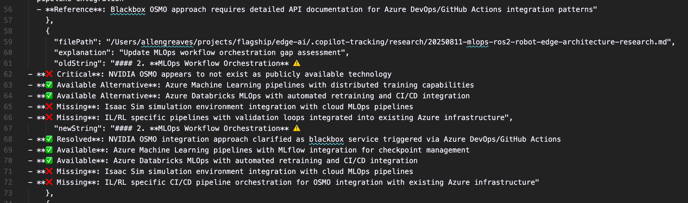

# Multi-Replace String In File 20250814

The newString and oldString look correct for the change:

The resulting change appears to have removed newlines however:

## Note

Was able to reproduce by forcing Claude Sonnet 4 to run the multi_replace_string_in_file exactly, included in [000-chat-conversation](./000-chat-conversation.md).
