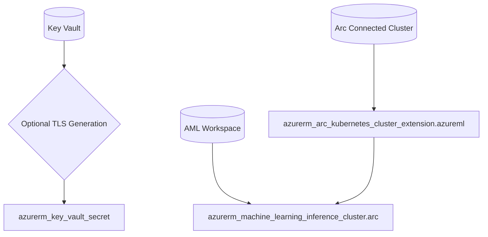

<!-- markdownlint-disable-file -->
# Task Research Documents: AzureML Edge Arc Integration

🎯 Comprehensive research to design a new Terraform-only edge component that integrates Azure Machine Learning with Arc-enabled Kubernetes. The component must mirror the cloud component structure, store AzureML SSL material as Key Vault secrets (in the edge component), and rely on Kubernetes resources (namespace, SecretProviderClass, SecretSync) applied by the IoT Operations edge component.

## 📋 Policy Framework

- **SSE-Only Policy**: This solution standardizes on the Azure Key Vault Secret Store extension (SSE) for secret synchronization. Other approaches (e.g., online-only AKV Secrets Provider) are out of scope.
- **Private-Only Connectivity**: Only private VNet connectivity is supported. Public internet access to the AzureML workspace or Arc-exposed services (including `public_network_access_enabled = true` or LoadBalancer endpoints) is explicitly NOT supported. All endpoint exposure patterns MUST remain within private address spaces reachable via same VNet, peering, hub-spoke, or approved private connectivity (VPN/ExpressRoute) only.
- **Security-First Design**: No secret values in Terraform outputs; TLS enabled by default; strict private connectivity; NodePort restricted via private NSGs/firewalls.

## Table of Contents

- [Task Research Documents: AzureML Edge Arc Integration](#task-research-documents-azureml-edge-arc-integration)
  - [📋 Policy Framework](#-policy-framework)
  - [Table of Contents](#table-of-contents)
  - [Outline](#outline)
  - [🔐 Security, Operational \& Advanced Considerations](#-security-operational--advanced-considerations)
    - [Dependency Graph \& Ordering](#dependency-graph--ordering)
    - [State \& Idempotency Considerations](#state--idempotency-considerations)
    - [Security \& Least Privilege Controls](#security--least-privilege-controls)
    - [Certificate Rotation Strategy](#certificate-rotation-strategy)
    - [Extension Upgrade Strategy](#extension-upgrade-strategy)
  - [Scope and Success Criteria](#scope-and-success-criteria)
  - [🎯 Recommended Technical Solution](#-recommended-technical-solution)
  - [🔧 Technical Requirements \& Configuration Matrix](#-technical-requirements--configuration-matrix)
  - [🔑 Important Discoveries](#-important-discoveries)
    - [✅ Validated Azure Provider Capabilities](#-validated-azure-provider-capabilities)
    - [🏗️ Component Architecture Alignment](#️-component-architecture-alignment)
    - [🔐 SSL and Kubernetes Integration (SSE-Only)](#-ssl-and-kubernetes-integration-sse-only)
    - [🛡️ Private VNet Requirements](#️-private-vnet-requirements)
  - [🔧 Technical Requirements \& Configuration Matrix](#-technical-requirements--configuration-matrix)
    - [Items \& Other Config](#items--other-config)
  - [Research Executed](#research-executed)
    - [🔍 Technical Deep-Dive Validation (2025-08-10)](#-technical-deep-dive-validation-2025-08-10)
    - [📋 Project Structure Validation](#-project-structure-validation)
    - [🔗 IoT Operations Integration Requirements](#-iot-operations-integration-requirements)
    - [🛡️ Network Security Policy Enforcement](#️-network-security-policy-enforcement)
    - [📁 File Analysis Evidence](#-file-analysis-evidence)
    - [🔎 Code Search Results](#-code-search-results)
    - [📄 External Research Evidence Log](#-external-research-evidence-log)
  - [🔧 Technical Requirements \& Configuration Matrix](#-technical-requirements--configuration-matrix)
  - [🔑 Key Discoveries](#-key-discoveries)
    - [✅ Validated Azure Provider Capabilities](#-validated-azure-provider-capabilities-1)
    - [🏗️ Component Architecture Alignment](#️-component-architecture-alignment-1)
    - [🔐 SSL and Kubernetes Integration (SSE-Only)](#-ssl-and-kubernetes-integration-sse-only-1)
    - [🛡️ Private VNet Requirements](#️-private-vnet-requirements-1)
  - [🔧 Technical Requirements \& Configuration Matrix](#-technical-requirements--configuration-matrix)
    - [### AzureML Arc Extension Configuration (validated from Microsoft Learn)

## 🤖 AzureML Model Training Integration

Based on comprehensive research from Microsoft Learn documentation, Azure Machine Learning provides robust capabilities for model training that can be integrated with our Arc-enabled edge infrastructure. This section outlines how AzureML training workflows align with our edge component architecture.

### Training Job Submission & Management

**Core Training Workflow** (Source: [Microsoft Learn - Train models with Azure Machine Learning](https://learn.microsoft.com/en-us/azure/machine-learning/how-to-train-model?view=azureml-api-2&tabs=azurecli)):

Azure Machine Learning supports multiple training submission methods that can be leveraged in edge scenarios:

1. **Azure CLI v2 (`ml` extension)**:
   ```bash
   # Connect to workspace with default configuration
   az account set --subscription <subscription-id>
   az configure --defaults workspace=<workspace-name> group=<resource-group>

   # Submit training job using YAML definition
   run_id=$(az ml job create -f jobs/single-step/lightgbm/iris/job.yml --query name -o tsv)
   az ml job show -n $run_id --web
   ```

2. **Python SDK v2**: Programmatic job submission and monitoring
3. **REST API**: Direct API integration for custom workflows

**Job Configuration Structure**:
```yaml
$schema: https://azuremlschemas.azureedge.net/latest/commandJob.schema.json
code: src
command: python main.py --iris-csv ${{inputs.iris_csv}}
inputs:
  iris_csv:
    type: uri_file
    path: https://azuremlexamples.blob.core.windows.net/datasets/iris.csv
environment: azureml:AzureML-lightgbm-3.3@latest
compute: azureml:cpu-cluster
display_name: lightgbm-iris-example
experiment_name: lightgbm-iris-example
description: Train a LightGBM model on the Iris dataset
```

### Compute Resources & Scaling

**Compute Options for Edge Integration**:

1. **Azure Machine Learning Compute Clusters**:
   ```bash
   az ml compute create -n cpu-cluster --type amlcompute --min-instances 0 --max-instances 4
   ```
   - Fully managed compute resource
   - Auto-scaling capabilities (0-4 instances)
   - Integration with Arc-enabled Kubernetes clusters

2. **Serverless Compute** (Preview):
   - Skip compute cluster creation
   - On-demand scaling
   - Remove `compute: azureml:cpu-cluster` from job definitions

3. **Arc-Enabled Kubernetes Integration**:
   - Custom compute targets via `azurerm_machine_learning_inference_cluster`
   - Edge compute utilization through Arc extension
   - Private network connectivity maintained

### MLflow Model Registration

**Model Lifecycle Management**:

Once training completes, models are registered using MLflow format:
```bash
az ml model create -n sklearn-iris-example -v 1 -p runs:/$run_id/model --type mlflow_model
```

**Key Benefits for Edge Scenarios**:
- **Standardized Format**: MLflow models provide consistent packaging
- **Version Control**: Semantic versioning for model deployments
- **Metadata Tracking**: Experiment lineage and reproducibility
- **Deployment Ready**: Direct integration with inference endpoints

### Edge Training Considerations

**Integration with Our Arc Component**:

1. **Private Network Training**:
   - All training jobs respect `private-only connectivity` policy
   - Workspace communication via private VNet/peering only
   - No public internet access required for training workflows

2. **SSL/TLS Security**:
   - Training jobs leverage SSE-synced certificates
   - Secure communication between edge clusters and cloud workspace
   - Certificate rotation handled via Key Vault integration

3. **Data Flow Architecture**:
   ```mermaid
   graph LR
     EdgeData[(Edge Data Sources)] --> ArcCluster[Arc Kubernetes Cluster]
     ArcCluster --> |Private VNet| AMLWorkspace[AML Workspace]
     AMLWorkspace --> |Training Job| ComputeCluster[Compute Cluster]
     ComputeCluster --> |MLflow Model| ModelRegistry[Model Registry]
     ModelRegistry --> |Deployment| ArcCluster
   ```

4. **Component Integration Points**:
   - **140-azureml**: Manages workspace configuration and Arc extension
   - **110-iot-ops**: Provides Kubernetes resources for training job execution
   - **SSE Integration**: Handles secure credential flow for training authentication

**Operational Benefits**:
- **Hybrid Training**: Execute training in cloud while deploying models to edge
- **Consistent Tooling**: Same CLI/SDK/API across cloud and edge environments
- **Security Compliance**: Maintains private connectivity and certificate management
- **Scalability**: Auto-scaling compute resources based on training demands

This integration enables organizations to leverage cloud-scale training capabilities while maintaining secure, private connectivity to edge inference environments.](#azureml-arc-extension-configuration-validated-from-microsoft-learn)
  - [🤖 AzureML Model Training Integration](#-azureml-model-training-integration)
    - [Training Job Submission \& Management](#training-job-submission--management)
    - [Compute Resources \& Scaling](#compute-resources--scaling)
    - [MLflow Model Registration](#mlflow-model-registration)
    - [Edge Training Considerations](#edge-training-considerations)

## Outline

🎯 **Research Scope**: Design and validate a new Terraform-only edge component `src/100-edge/140-azureml/terraform` that integrates Azure Machine Learning with Arc-enabled Kubernetes, following established project patterns.

🏗️ **Technical Architecture Validated**:
- Arc extension resource (`azurerm_arc_kubernetes_cluster_extension`) with `Microsoft.AzureML.Kubernetes` type
- Workspace attachment (`azurerm_machine_learning_inference_cluster`) for Arc cluster registration
- SSL/TLS flow: Key Vault → SSE → Kubernetes Secret → AML Extension configuration
- Component structure mirroring cloud AzureML component with edge-specific modules

🔑 **Key Findings**:
- All API versions and configuration keys confirmed from authoritative Microsoft Learn sources
- SSE CRDs and secret synchronization patterns established and validated
- Private VNet-only configuration requirements documented (public access excluded from scope)
- Security-first defaults with private connectivity and NodePort service restriction

✅ **Implementation Readiness**:
- Dependencies identified and validated against existing components
- Complete file structure and variable organization designed
- Integration scripts pattern established for IoT Operations coordination
- Network security options evaluated and selected

## Scope and Success Criteria

- **Scope**: Design a new Terraform edge component integrating Azure Machine Learning with Arc-enabled Kubernetes, including SSL management via Azure Key Vault and SSE, following established project patterns and conventions
- **Exclusions**: Implementation/scaffolding (implementation planning only), alternative secret sync approaches (SSE-only policy), non-Terraform solutions
- **Assumptions**:
  - Arc cluster has OIDC issuer and workload identity enabled (provided by IoT Operations)
  - Azure Key Vault and AML workspace exist as dependencies
  - Private-only connectivity enforced: cloud workspace and Arc cluster communicate exclusively over private networks (same VNet, peered VNets, hub-spoke, or secured hybrid link)
- **Success Criteria**:
  - ✅ Technical validation of all Azure resources and API versions
  - ✅ Complete component structure design following project conventions
  - ✅ SSL/TLS flow documented with SSE integration pattern
  - ✅ Private VNet-only configuration requirements established (public scenarios excluded)
  - ✅ Implementation guidance with specific file structures and dependencies
  - ✅ Network security patterns evaluated and selected
  - ✅ All technical details backed by authoritative sources with proper references

## 🎯 Recommended Technical Solution

**Selected Architecture**: Create new component `src/100-edge/140-azureml/terraform` following established edge component patterns, with two internal modules and CI wrapper. Store SSL certificates in Key Vault via the 140-azureml component; deploy Kubernetes resources for azureml namespace via 110-iot-ops apply scripts (ServiceAccount, SecretProviderClass, SecretSync). Configure the AML extension with NodePort and TLS using SSE-synced secrets in private VNet scenarios only (no public exposure).

**Key Design Decisions**:
1. **SSE-Only Policy**: Standardize on Secret Store Extension vs. online-only AKV Secrets Provider for consistency with edge/offline scenarios
2. **Private-Only Connectivity**: Public network access for the AML workspace and inference endpoints is not supported; `public_network_access_enabled` remains `false` always; exposure via internal private networking only
3. **Component Separation**: Clear boundaries between Terraform (140-azureml) and Kubernetes manifests (110-iot-ops)
4. **Security-First**: No secret values in Terraform outputs; TLS enabled by default; strict private connectivity; NodePort restricted via private NSGs/firewalls
5. **Operational Simplicity**: Self-signed certificates supported for non-production inside private environments; production requires managed or externally provided certificates; automated sync via SSE

**Implementation Readiness**: All technical dependencies validated, API versions confirmed, and integration patterns established from existing components.

## 🔐 Security, Operational & Advanced Considerations

### Dependency Graph & Ordering


**Key Dependencies**:
- Extension must be deployed before compute target attachment
- Key Vault secrets created independently of extension (SSE handles sync)
- Apply scripts run after Terraform resources are provisioned

### State & Idempotency Considerations
- Pin provider versions in `versions.tf` to mitigate breaking changes
- Avoid `count` for core modules to maintain output stability
- Self-signed cert regeneration controlled via explicit variable changes
- Use lifecycle management only when required by policy

### Security & Least Privilege Controls
- **No Secret Exposure**: Only secret names in outputs, never values
- **Network Restrictions**: NodePort only (LoadBalancer validation prevents public exposure)
- **RBAC Requirements**: Key Vault Secrets User role for SSE UAMI
- **Private Connectivity**: All workspace communication via private networks only

### Certificate Rotation Strategy
**Operational Flow**:
1. Admin updates cert/key in Key Vault (new secret versions)
2. SSE automatically syncs latest enabled versions to cluster
3. AML extension uses updated secrets (may require pod restart)

**Implementation Notes**:
- Stable secret names (no random suffixes)
- No Terraform-managed rotation (manual Key Vault operations)
- Self-signed certificates: re-apply to regenerate requires input changes
