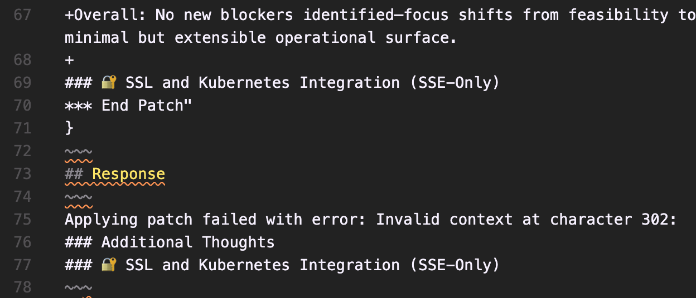

# Apply Patch 20250813-1350

Looking at [005-apply-patch.copilotmd](./005-apply-patch.copilotmd), a line for the `[context_after]` does not include a space ` ` in front of the existing line (this one -> `### 🔐 SSL and Kubernetes Integration (SSE-Only)`):

```plaintext
+Overall: No new blockers identified—focus shifts from feasibility to codifying guardrails, automation of rotation/validation workflows, and building a minimal but extensible operational surface.
+
### 🔐 SSL and Kubernetes Integration (SSE-Only)
*** End Patch"
}
```



The gpt-4o-mini model makes the same mistake when looking at [004-healApplyPatch.copilotmd](./004-healApplyPatch.copilot.md).

Failures continued to persist throughout each of the subsequent apply_patch calls as gpt-5 tried to remove the extra necessary context to fix the problem.

Eventually it finished by making a change in the wrong place

## Note

The final change that ultimately went in to the document, is different from the original change that gpt-5 was attempting to make.
